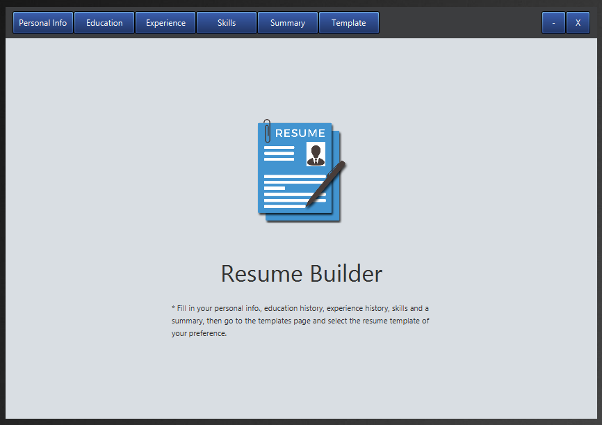

# resume-builder

## Introduction:
Resume Builder is a desktop application which you can use to build your resume.

## To clone and run this project:
* Run the command git@github.com:HamzaHamdan/resume-builder.git
* Open the project in eclipse
* Right click the project
* Run As > Run Configurations
* Go to arguments tab and add the below line to VM arguments: --module-path="path\to\javafx\sdk\11.0.2\lib" --add-modules=javafx.controls,javafx.fxml 

* Add JavaFX user library if it does not exist 

* Run the project
* Enjoy!

## Application Screenshots:

